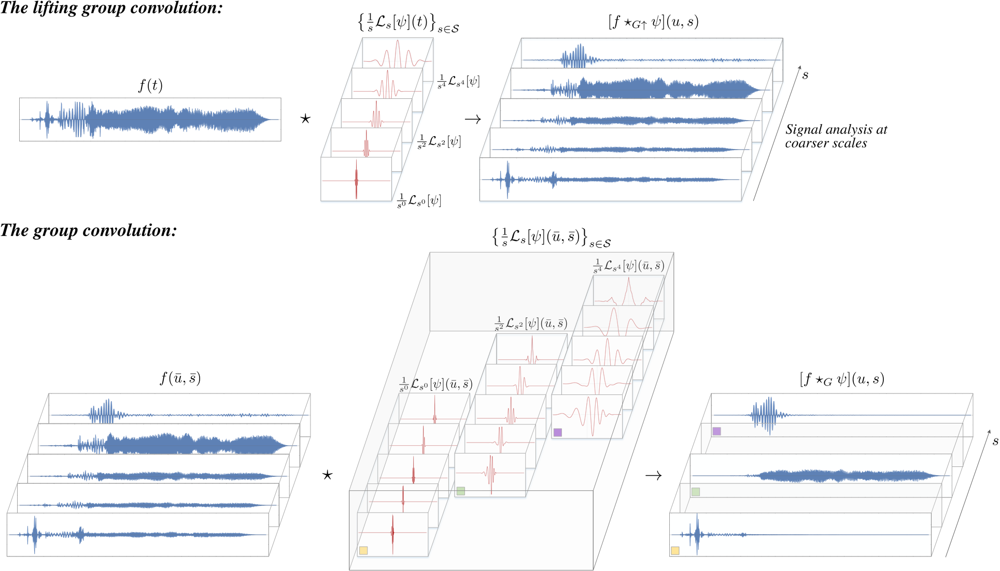

## Wavelet Networks: Scale-Translation Equivariant Learning From Raw Time-Series

This repository contains the source code accompanying the paper:
 
[Wavelet Networks: Scale Equivariant Learning From Raw Time-Series](https://arxiv.org/abs/2006.05259) <br/>**David W. Romero, Erik J. Bekkers, Jakub M. Tomczak & Mark Hoogendoorn**. 

*Leveraging the symmetries inherent to specific data domains for the construction of equivariant neural networks has lead to remarkable improvements in terms of data efficiency and generalization. However, most existing research focuses on symmetries arising from planar and volumetric data, leaving a crucial data source largely underexplored: *time-series*. In this work, we fill this gap by leveraging the symmetries inherent to time-series for the construction of equivariant neural network. We identify two core symmetries: *scale and translation*, and construct scale-translation equivariant neural networks for time-series learning. Intriguingly, we find that scale-translation equivariant mappings share strong resemblance with the *wavelet transform*. Inspired by this resemblance, we term our networks *Wavelet Networks*, and show that they perform nested non-linear wavelet-like time-frequency transforms. Empirical results show that Wavelet Networks outperform conventional CNNs on raw waveforms, and match strongly engineered spectrogram techniques across several tasks and time-series types, including audio, environmental sounds, and electrical signals.* 



## Folder structure
The folder structure is as follows:

* `eerie` contains the main PyTorch library. 

* `demo` includes some short jupyter notebook demo's on how to use the the code. #TODO put in notebook.

* `experiments` contains the experiments described in the paper.

## Dependencies

This code as based on PyTorch and has been tested with the following library versions:

* torch==1.5.0

* torchaudio==0.5.0

* numpy==1.18.1

* scipy==1.4.1

* matplotlib==3.1.2

* jupyter==1.0.0

The exact specification of our environment is provided in the file `environment.yml`. An appropriate environment can be easily created via:
```
conda env create -f environment.yml
```
or constructed manually with conda via:
```
conda update -n base -c defaults conda
conda create -n eerie python=3.7
conda install pytorch torchvision cudatoolkit=10.1 -c pytorch
conda install pandas
conda install -c pytorch torchaudio
pip install nonechucks
conda install -c conda-forge python-dotenv
conda install -c anaconda pydot -y
conda install -c anaconda requests -y
conda install -c conda-forge pydub -y
conda install -c conda-forge audioread -y
conda install -c conda-forge librosa -y
conda install -c conda-forge tqdm
conda install -c anaconda h5py
conda install -c conda-forge musdb
conda install -c conda-forge sortedcontainers
pip install museval
```

## Experiments
For the sake of reproducibility, we provide the parameters used in the corresponding baselines hardcoded by default. If you wish to vary these parameters
for your own experiments, please modify the corresponding `parser.py` file in the experiment folder and erase the hard-coded values from the `run_experiment.py` file.

**Remark on `Logger` in experiments.** We provide a logger system that automatically saves any print during the execution of the program into a file named `saved/foldername/modellog_i.out`. 
The logger object is created right before the training starts in the `run_experiment.py` file (line `sys.stdout = Logger(args)`). We recommend users working in an `slurm` environment to comment this line, as it will 
otherwise impede writing into the corresponding `slurm_####.out` file. Hence, you won't be able to see any prints in the `slurm_####.out` file. Deactivated here by default.  

### Pretrained Models
We provide some pretrained models from our experiments for easy reproducibility. To use these models, utilize the keyword `--pretrained` and make sure
the training parameters as well as the additional `--extra_comment` argument correspond to those given in the folder name.

### Datasets

**UrbanSound8K:** The dataset can be downloaded here: http://urbansounddataset.weebly.com/urbansound8k.html

Note that both baselines utilize different sample-rates and training schemas. This can be modified in `experiments/UrbanSound8K/dataset.py` by (1) changing
`self.sampling_rate` in the definition of the `UrbanSoundDataset` class and (2) replacing the folds included in the train-, val- and test-set's in the `get_dataset` function. 

**MagnaTagATune:** The dataset can be downloaded here: http://mirg.city.ac.uk/codeapps/the-magnatagatune-dataset
###### Preprocessing 
* Fix `config.py` file
* run ` python audio_processor.py ` :  audio (to read audio signal from mp3s and save as npy) ~60GBs
* run ` python annot_processor.py ` :  annotation (process redundant tags and select top N=50 tags). This will create and save train/valid/test annotation files

        * References*
        * [https://github.com/jongpillee/sampleCNN](https://github.com/jongpillee/sampleCNN)
        * [https://github.com/tae-jun/sample-cnn](https://github.com/tae-jun/sample-cnn)
        * [https://github.com/keunwoochoi/magnatagatune-list](https://github.com/keunwoochoi/magnatagatune-list)


## Cite
If you found this work useful in your research, please consider citing:
```
@article{romero2020wavelet,
  title={Wavelet Networks: Scale Equivariant Learning From Raw Waveforms},
  author={Romero, David W and Bekkers, Erik J and Tomczak, Jakub M and Hoogendoorn, Mark},
  journal={arXiv preprint arXiv:2006.05259},
  year={2020}
}
```

## License

The code and scripts in this repository are distributed under MIT license. See LICENSE file.
